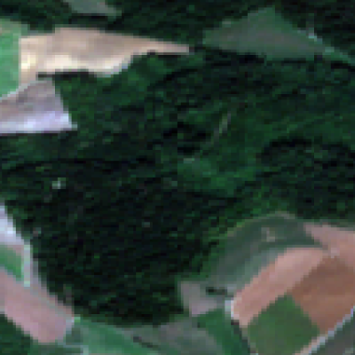
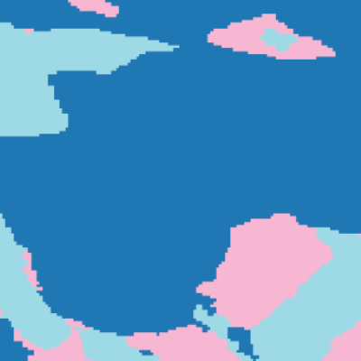
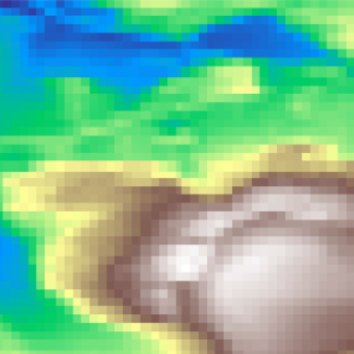

<div align="center">
    <a href="./">
        
    </a>
</div>


## A comprehensive geospatial dataset that merges Sentinel-2 remote sensing, weather data, and terrain features to support artificial intelligence models for predicting ecosystem dynamics


[](#)  
[](#)

🔥 Our paper [_Complete in the future_](#) 

---
<div align="center">
    <a href="./">
        
    </a>
    <a href="./">
        
    </a>
    <a href="./">
        
    </a>
</div>


## 🏷️ Description 

**GeoClimaData** comprises time series (2018-2024) data from Sentinel-2 bands (B02, B03, B04, and B05), along with [the Global 30m Digital Elevation Model](https://developers.google.com/earth-engine/datasets/catalog/COPERNICUS_DEM_GLO30) and [the ESA WorldCover 10m v200](https://developers.google.com/earth-engine/datasets/catalog/ESA_WorldCover_v200). Additionally, it includes data from [ERA5 daily Climate Data](https://developers.google.com/earth-engine/datasets/catalog/ECMWF_ERA5_LAND_DAILY_AGGR#bands), which consists of temperature, surface pressure, total precipitation, surface net solar radiation, and the leaf area index for both low and high vegetation.

The dataset covers several countries around the world. To keep the information organized, each country was coded according to the **ISO 3166-1 alpha-3** standard. For example, Belgium is represented as **BEL**. For each country, a grid of points was generated with a spacing of **10 km or 25 km**, depending on the country's size. In this repository, you will find the coordinates for each country in the **EPSG:4326 (WGS 84)** format in the folder **countries**, allowing you to replicate the dataset.


---

## 📥 GeoClimaData Dataset Download

Ensure `GeoClimaData` is installed and allocate at least **5TB** of disk space. The data was saved in `.nc` file format to reduce the amount of storage required. We generate **GeoClimaData** and train our models using Python 3.9.16. Therefore, we recommend using at least this version to ensure compatibility when running the code.

```python
We need to complete this once everything is tested
```


---

## 🏗️ Dataset Generation

In the folder named **gcpcountries**, you will find the coordinates used to generate the minicubes. For each country, a grid of points was created with spacing of 10 km, 50 km, or 100 km, depending on the country's size.

# Sentinel-2 Time Series Downloader with WorldCover & DEM Integration  

This Python script automates the daily retrieval of Sentinel-2 surface reflectance data using **Google Earth Engine (GEE)**, mosaicking cloud-free images, and exporting them as **NetCDF**. The dataset includes:  

## Features  

✅ **Sentinel-2 Bands** (B2, B3, B4, B8, SCL)  
✅ **ESA WorldCover (Land Cover) Integration**  
✅ **Copernicus DEM (GLO-30) Elevation Data**  
✅ **Parallel Processing for Multiple Locations**  

## Functionality  

- 📍 **Point-based Extraction**: Define a location (`latitude`, `longitude`) to generate a time-series dataset.  
- 📄 **CSV Batch Processing**: Download multiple locations in parallel from a CSV file.  

## Usage  

### Single Location Extraction  
```python
download_s2_timeseries_worldcover_minicube(
    lon_lat=(lon, lat), 
    start_date="2020-01-01", 
    end_date="2024-12-31", 
    out_folder="output_data"
)

```


---

## 📖 Citation

If you use this code, please cite our paper:


## 📧 Contact

For any inquiries or collaboration opportunities, feel free to reach out to 🎓 <a href="http://www.earthmapps.io/people.html" target="_blank">Dr. Stef Lhermitte</a> or 🎓 <a href="https://eapolo.github.io/research/" target="_blank">Dr. O. Enrique Apolo-Apolo</a>.

---


